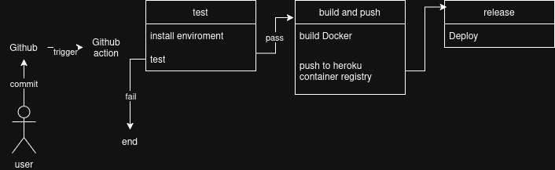

## Helsinki-project
A tinder clone with genAI
## Description
Live demo: [App](https://helsinki-project-4693902e7d95.herokuapp.com/)

## Technologies 
Front End:
- React
- Tailwind

Back End:
- Express
- MongoDB
- Nodejs

CICD:
- Docker
- Github Action

Test:
- Jest
## Run Locally

**Clone the repository**:
   ```sh
   git clone [https://github.com/DucLUT/portfolioo.git](https://github.com/DucLUT/Helsinki-project.git)
   cd Helsinki-project
   ```

- Set up `.env` file in `server` directory with the following content:
```bash
# Application Configuration
PORT=8080
NODE_ENV=development # Or 'production' when deploying

# MongoDB Configuration
# Connection string for your primary MongoDB database
MONGO_URI=mongodb+srv://<your_mongodb_username>:<your_mongodb_password>@<your_cluster_address>/<your_database_name>?retryWrites=true&w=majority
# Connection string for your MongoDB test database (if applicable)
TEST_MONGODB_URI=mongodb+srv://<your_mongodb_username>:<your_mongodb_password>@<your_cluster_address>/<your_test_database_name>?retryWrites=true&w=majority

# JSON Web Token (JWT) Configuration
JWT_SECRET=your_very_strong_and_secret_jwt_key # Replace with a strong, unique secret

# Cloudinary Configuration (for image and video management)
CLOUDINARY_CLOUD_NAME=your_cloudinary_cloud_name
CLOUDINARY_API_KEY=your_cloudinary_api_key
CLOUDINARY_API_SECRET=your_cloudinary_api_secret

# Client URL Configuration
# URL where the client/frontend application is running during production/deployment
CLIENT_URL=http://localhost:8080 # Or your deployed frontend URL
# URL where the client/frontend application is running during development
CLIENT_URL_DEV=http://localhost:5173 # Or your local development frontend URL

# OpenAI API Configuration
OPENAI_API_KEY=sk-your_openai_api_key # Replace with your actual OpenAI API key

# Docker Configuration (Optional - set to true if running in Docker)
DOCKER=true

```
*From root

   ```sh
   npm run install
   npm run build
   npm start
   ```
## Timeline

Table:

| Date (Month.Day.Year) | Task | Labour (hours) |
| --- | --- | --- |
| 03.31.2025 | Brain Storm | 1 |
| 03.31.2025 | Setting up environment | 2 |
| 04.01.2025 | Adding templete for models, routes, and controllers for API | 8 |
| 04.01.2025 | Setting Database and connect DB to the application | 3 |
| 04.04.2025 | Adding authentication and auth middleware | 8 |
| 04.01.2025 | Adding the models for user and message | 3 |
| 04.16.2025 | Adding the update profile | 4 |
| 04.04.2025 | Adding UI on client and setting global state management | 7 |
| 04.05.2025 | Adding UI for auth page | 10 |
| 04.18.2025 | Adding headers and mobile views | 5 |
| 04.17.2025 | Adding dashboard and for user | 5 |
| 04.16.2025 | Adding image handle for user | 4 |
| 04.01.2025 | Config OpenAI API and cloudinary API | 3 |
| 05.01.2025 | Adding websocket both client and server | 5 |
| 05.01.2025 | Addinng the notification and message using websocket | 5 |
| 05.05.2025 | Adding chatbot and generate pickup line for user | 5 |
| 05.07.2025 | Adding container | 8 |
| 05.09.2025 | Splitting development state and production state | 4 |
| 05.12.2025 | Adding tests for API | 15 |
| 05.10.2025 | Deploying | 5 |
| 05.13.2025 | Adding workflow for (github action) | 15 |
| 05.16.2025 | Fix bug and debug | 15 |
| 05.16.2025 | Adding CSP and large payload handle for server | 3 |
| **Total** | | **143** |

*CICD pipleline*


*Reference:
https://www.youtube.com/watch?v=o-XOBJRNeqk&list=LL&index=7&t=17900s
